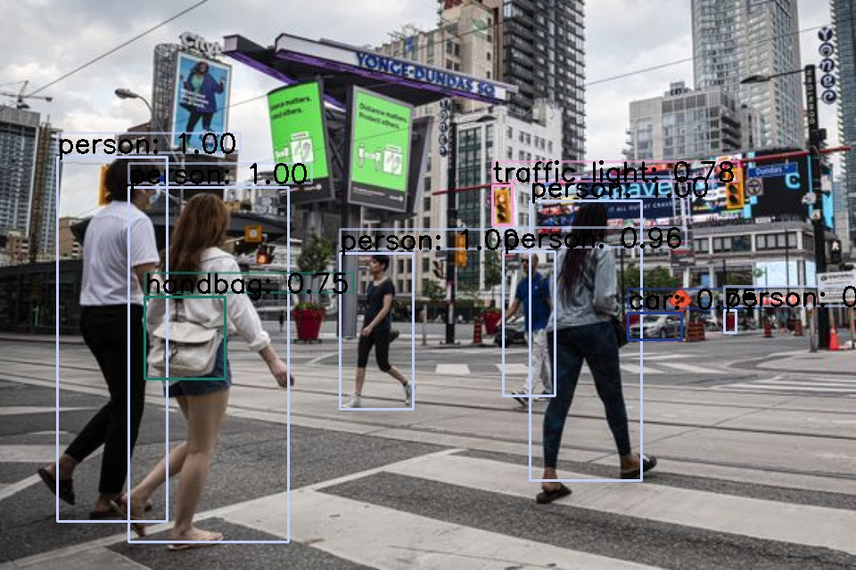

# YOLO_object_detection

YOLO (You Only Look Once) is a single stage detector which is faster than any RCNN model and is relatively precise. So, it can be used in real time video footages.

YOLO is a great model for object detection. In this project, YOLOv3 (the best version till now) is used, trained on COCO dataset [COCO](src/images.txt).

## Requirements

- YOLOv3 - COCO dataset
- OpenCV
- numpy

## Things to do

Upon running the program, you need to provide the following:

- image source
- output path
- confidence value, used to filter out weak detections (50% would be good)
- threshold value, a NMS(Non-MAxia Supression) threshold

## Quick review

1. Link all the COCO class labels uniquely with different colours (for bounding boxes).
2. Load YOLO from disk using OpenCV's DNN model.
3. Load the image and pass it through the neural network model.
4. Determine the output layer names from YOLO model.
5. Construct a blob from the image.
6. Perform forward pass through YOLO network to get class probabilities of each class for all output layers. In this step, processing time can be analysed.
7. Loop over each output layer, determine the most probable detection - if it has sufficiently large confidence, only then save its corresponding class name and position.
8. Now for every saved detection, draw the bounding box and write over the class names (if you wish!).
9. Applying NMS supresses significantly overlapping bounding boxes, thus gives a clean output.

## Results

